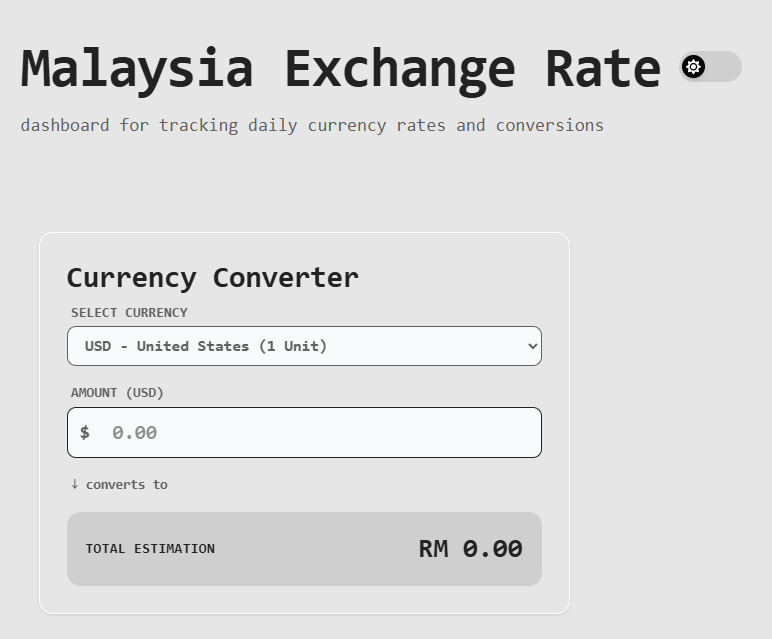
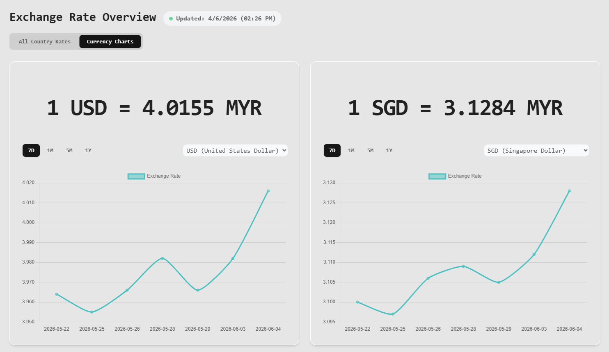

# Malaysia Currency Exchange Rate

a lightweight, ad-free currency exchange web application tailored specifically for the Malaysian market. It connects directly to the official Bank Negara Malaysia (BNM) API to deliver authoritative, real-time exchange rates straight from the local primary source without any third-party data latency or intrusive advertisements.

🔗 **Live Demo:** https://myr-currency-exchange.vercel.app

## Problem
- **Overcomplicated Interfaces:** Most currency converters are built for a global audience, forcing users to wade through hundreds of irrelevant currency pairs just to find what they need.
- **Lack of Local Focus:** As someone living in Malaysia, my primary need is simply converting other currencies back to Malaysian Ringgit (MYR). Generic tools don't prioritize this, making the workflow slow and inefficient.
- **Reliance on Global Middlemen:** Platforms often use third-party global aggregators rather than primary sources, leading to data latency and a lack of official regulatory backing for local market tracking.
- **Cluttered and Restricted UX:** compromise the user experience with intrusive advertisements.

## Solution
- **MYR-Centric Conversion:**  The interface is explicitly tailored for the Malaysian market, eliminating unnecessary complexity by focusing entirely on converting foreign currencies directly to and from MYR.
- **Direct Local Sourcing:**  The app cuts out third-party middlemen by pulling data directly from the country's central bank via the official Bank Negara Malaysia (BNM) API.
- **Authoritative Accuracy:**  Leverages the primary local regulatory source to guarantee official, real-time Malaysian Ringgit exchange rates.
- **Clean, Ad-Free UI:**      Provides a streamlined, lightweight interface designed intentionally to deliver critical financial data quickly and without any distracting advertisement components.


## Tech Stack
| Layer | Technology | Purpose |
| :--- | :--- | :--- |
| **Framework** | **React (TypeScript)** | Ensures type-safe component architecture and predictable state management. |
| **Tool** | **Vite** | Provides near-instantaneous Hot Module Replacement (HMR) and optimized production builds. |
| **Styling & UI** | **TailwindCSS** | Facilitates rapid, utility-first responsive design without bloated CSS stylesheets. |
| **Data Visualization** | **Chart.js, react-chartjs-2** | Renders performant, responsive canvas charts for historical trend analysis. |
| **Design Elements** | **FontAwesome, country-flag-icons** | Delivers scalable vector icons and localized, lightweight SVG flags. |

## Architecture & Implementation

### API, Components, and Hooks
- **API Handling:** All Bank Negara Malaysia API calls are encapsulated, ensuring clean separation of data fetching from the UI.
- **Hooks:** Custom hooks manage state, perform calculations, and format data using `useMemo` to minimize unnecessary re-renders. 
- **Components:** The UI is modularized into discrete functional components (`Converter`, `Overview`, `Header`), promoting maintainability and clear responsibilities.

---

### Currency Conversion
- Fetches real-time exchange rates against MYR.
- Automatically normalizes unit scales for currencies traded in hundreds or thousands (e.g., IDR, JPY).
- Utilizes reactive state logic to calculate and render exact exchange values instantaneously.



---

### All Country Rates
- **Data Normalization:** Automatically maps raw API rates to readable country names and handles 100/1000 unit base adjustments.
- **Categorized UI:** Groups the final rate list by geographical region to enhance readability and user navigation.


---

### Charting & Historical Data Problem Solving
- **API Limitation Workaround:** Resolved an issue where historical data is restricted to monthly chunks, blocking native short-term dynamic date-range requests.
- **Data Processing:** Implemented an abstraction layer to dynamically calculate required timeframes, fetch the respective monthly datasets, and flatten the payloads.
- **Trend Visualization:** Optimized data slicing to feed clean, precise data points into the frontend charting library for accurate rolling 7-day trends.



---

## Setup Guide

### Prerequisites
- Node.js
- npm

### 1. Clone the repository
```bash
git clone https://github.com/wenjuin95/Currency-Exchange.git
cd Currency-Exchange
```

### 2. Install dependencies
```bash
npm install
```

### 3. Start the website
```bash
npm run dev
```

### 4. Open Application
Open `http://localhost:5173` in your browser.
*(If port `5173` is already in use, check your terminal output to see which port the server selected).*
